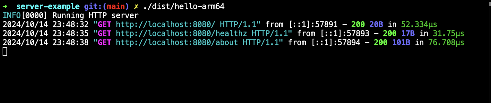
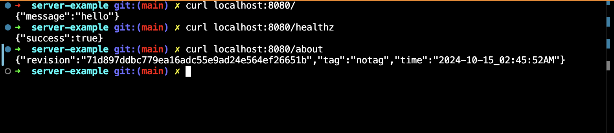

# Obvious Service Example

A _**simple example**_ to showcase the speed at which web apis can be implemented using the [server library](https://github.com/go-obvious/server)


## Quick Start

```sh
make build
```

### Runs the Server



### Test the API

