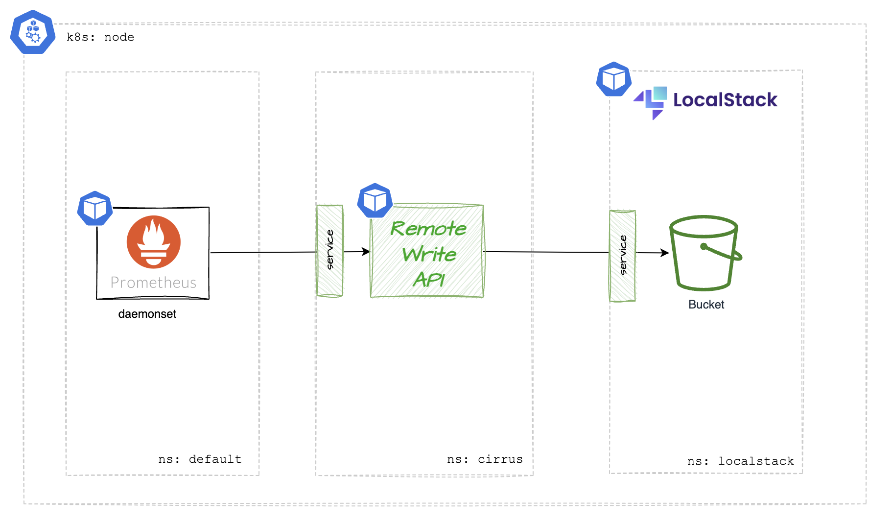
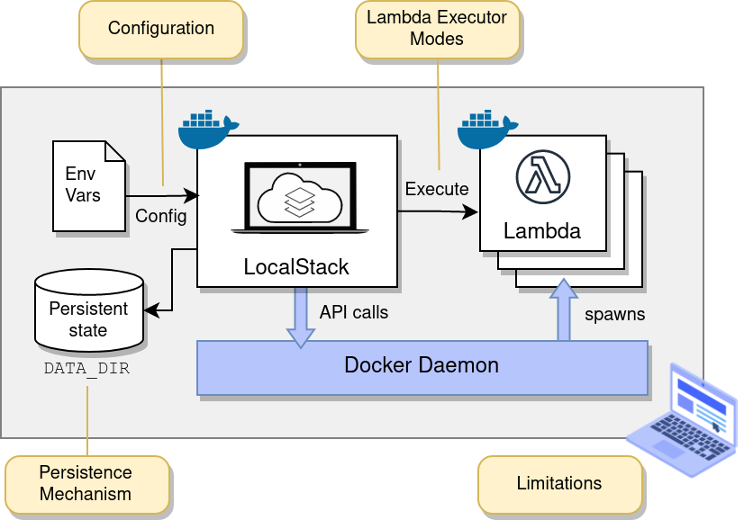

# Cirrus `Remote Write API` Proof of Value

This Proof of Value (PoV) is designed to provide a replacement Remote Write API written in golang. The goal it to showcase the ability to have high speed external APIs, which perform in less than `2 ms`.



## Prerequisites
* [aws cli](https://docs.aws.amazon.com/cli/latest/userguide/getting-started-install.html)
* [aws sam](https://github.com/localstack/aws-sam-cli-local)
* [golang 1.23](https://go.dev/doc/install)
* [kubectl](https://kubernetes.io/docs/tasks/tools/install-kubectl-macos/#install-kubectl-on-macos)
* [K8s cluster](https://github.com/rancher-sandbox/rancher-desktop/releases)

## LocalStack Deployment

[LocalStack Community](https://docs.localstack.cloud/user-guide/aws/feature-coverage/) is a container which exposes AWS compatible APIs - and emulated services. This makes development cheap in comparison with true Cloud Native development.



To deploy localstack do the following:

```sh
helm repo add localstack https://localstack.github.io/helm-charts
helm repo update
helm upgrade --install localstack localstack/localstack --create-namespace --namespace=localstack -f deploy/localstack/localstack-values.yaml
```

That's it, you can now try a few AWS CLI commands to prove it is working:

1. **Export test Environment Variables**

    ```sh
    export AWS_ACCESS_KEY_ID="test"
    export AWS_SECRET_ACCESS_KEY="test"
    export AWS_REGION="us-east-1"
    export AWS_ENDPOINT="http://localhost:4566"
    ```

2. **Define an alias for QoL**

    ```sh
    alias awslocal="aws --endpoint-url=$AWS_ENDPOINT"
    ```

3. **_Try making a bucket, listing it, then delete it._**

    ```sh
    awslocal s3api create-bucket --bucket foobar
    awslocal s3 ls
    awslocal s3api delete-bucket --bucket foobar
    ```


helm upgrade --install localstack localstack/localstack --create-namespace --namespace=localstack -f deploy/localstack/localstack-values.yaml
helm uninstall localstack --namespace=localstack

pip install aws-sam-cli-local
pip install awscli-local
npm install -g artillery@latest
make tests-load

curl -X PUT "http://f46e0790.execute-api.localhost.localstack.cloud:4566/1" \
    -H "Content-Type: application/json" \
    -data-binary "@fixtures/v2/put-product-data.json"
curl -X GET "http://f46e0790.execute-api.localhost.localstack.cloud:4566/1"

